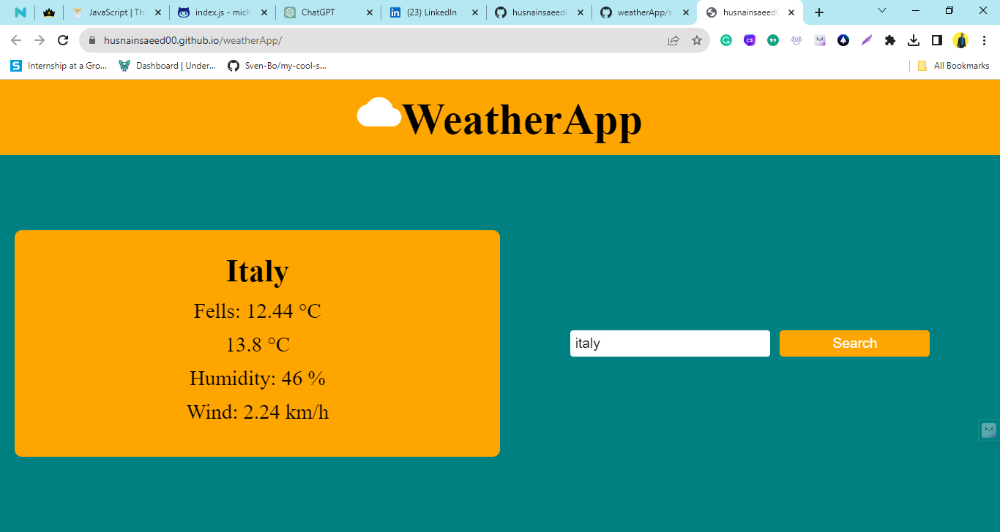

# Weather App

This Weather App provides current weather information for locations around the world. You can access the live app [here](https://husnainsaeed00.github.io/weatherApp/).

## Features

- **Search:** Enter a location to retrieve real-time weather data.
- **Display:** View current temperature, feels like temperature, humidity, and wind speed.
- **Responsive:** Works seamlessly on various devices - desktops, tablets, and mobile phones.

## Live Demo

Explore the live demo of the Weather App: [Weather App Live Demo](https://husnainsaeed00.github.io/weatherApp/)

## Technologies Used

- **HTML5**
- **CSS3**
- **JavaScript (ES6)**
- **Fetch API**: For fetching weather data from an external API.
- **Responsive Design**: Ensures compatibility across different devices.

## Getting Started

To run the Weather App locally:

1. Clone this repository: `git clone https://github.com/husnainsaeed00/weatherApp.git`
2. Open `index.html` in your web browser.

## Usage

1. Enter a location in the search field.
2. Press the search button or hit Enter.
3. View the current weather details for the entered location.

## Screenshots

## Credits

- Weather data provided by [WeatherAPI](https://www.weatherapi.com/).
- Icons by [Material-Icons](https://fonts.googleapis.com/icon?family=Material+Icons"
      rel="stylesheet")).

## Contributors

- [Husnain Saeed](https://github.com/husnainsaeed00)

## License

This project is licensed under the [MIT License](LICENSE).
